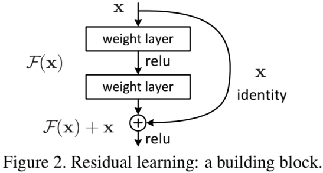
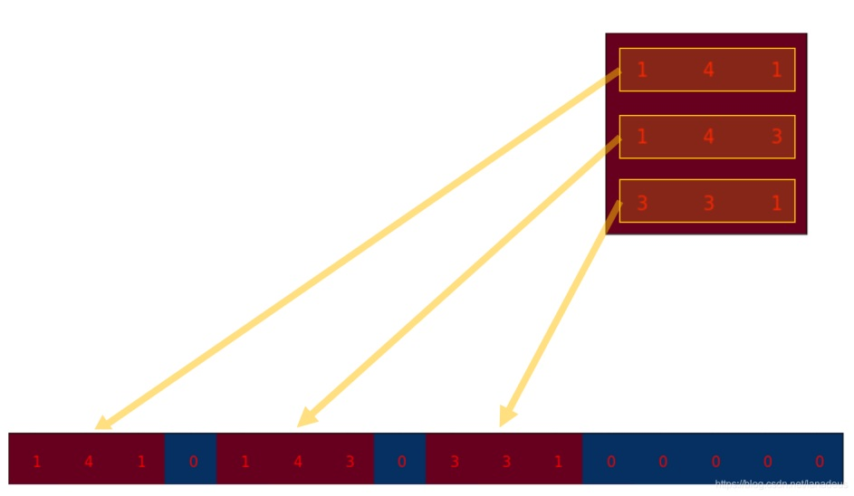
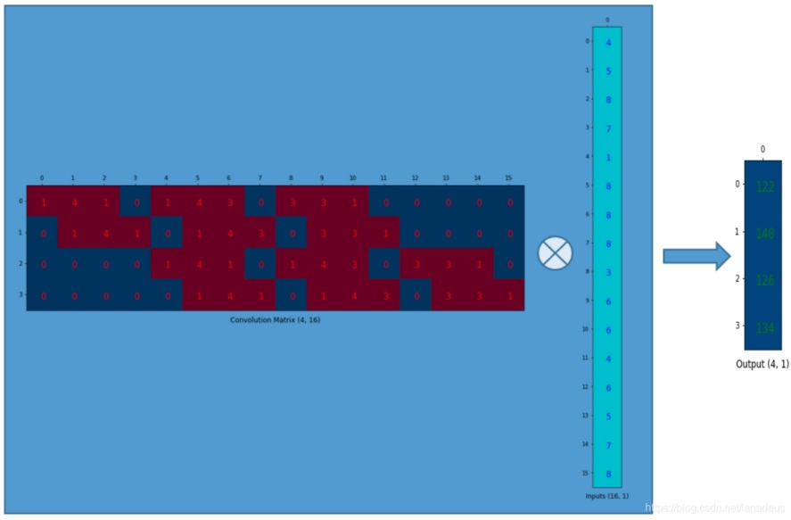
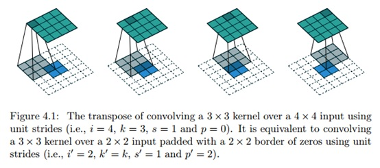

# 1. 简要介绍YOLOv3的特点

YOLOv3采用独创的darknet系列网络作为主干网络。

有如下工作：
+ darknet的设计借鉴了残差网络的思想，使用了大量的残差结构。darknet53与同等使用残差结构的resnet101、resnet152相比，在精度上基本相同，但在速度上更胜一筹。
+ 抛弃了pooling池化操作，直接使用步长为2的卷积来实现下采样。
+ 在特征融合方面，为了加强小目标的检测，引入了类似与FPN的多尺度特征融合，特征图在经过上采样后与前面层的输出进行concat操作，浅层特征和深层特征的融合，使得YOLOv3在小目标的精度上有了很大的提升。

YOLOv3的输出分为三个部分：置信度、坐标信息，分类信息。在推理的时候，特征图会等分成S\*S的网格，通过设置置信度阈值对格子进行筛选，如果某个格子上存在目标，那么这个格子就负责预测该物体的置信度、坐标和类别信息。

## 一问到底

### 1.1 残差结构的原理以及作用？

残差结构源自Resnet，ResNet网络是为了解决深度网络中的退化问题，即网络层数越深时，在数据集上表现的性能却越差。残差的本意是指实际观察值与估计值（拟合值）之间的差。下图为一个残差结构网络： $\text{Blockout:}H(x)=F(x)+x$ （反过来写就是残差形式 $F(x)=H(x)-x$ ，最终优化目标F(x)网络）

这么设计就是为了防止网络退化。极端情况学习到F(x)=0，此时H(x)=x。这样的神经网络不至于下一层结果比上一层结果还坏。本质上是个恒等（identity）代换

### 1.2* 数学证明Resnet有效

**证明一：梯度弥散（梯度为0）有效被针对（“网络可以更深”的原理证明）**
已知l+1层与l层的递归式，可得l层到L层的迭代式如下：

$$
x_{l+1}=x_l + F(x_l, W_l)
$$

$$
x_L=x_l+\sum_{i=l}^{L-1}F(x_i,W_i)
$$

~~（其实到这一步就已经可以看出来了）~~ 可得：

$$
\frac{∂\xi} {∂x_l} = \frac{∂\xi}{∂x_L}\frac{∂x_L}{∂x_l} = \frac{∂\xi}{∂x_L} (1 +\frac{∂}{∂x_l} \sum_{i=1}^{L-1}F(x_i, W_i))
$$

$\frac{∂\xi}{∂x_L}$ 部分不会为0。若为0，代表整体损失为0，应该考察下过拟合或网络错误问题。 $\frac{∂}{∂x_l} \sum\limits_{i=1}\limits^{L-1} F(x_i, W_i)$ 部分在一个batch中也不可能一直为-1。若一直为-1，那么说明网络完全更新不了。

**证明二：一维identity直连原理证明（“identity恒等分支不能随便加权重”原理证明）**
假设输入x前加上λ多线连接（λ是正整数，如果λ=0相当于不连接，λ=1相当于恒等identity连接，λ>1相当于在恒等连接上加个权重）那么递归式与迭代式的新格式如下：

$$
x_{l+1}=\lambda_l x_l + F(x_l, W_l)
$$

$$
x_L=(\prod_{i=1}^{L-l} \lambda_i)x_l+\sum_{i=1}^{L-l}(\prod_{j=i+1}^{L-l}\lambda_j)F(x_i,W_i)
$$

~~（同理细心地同学这一步也可以看出来了）~~ 从L层开始损失求导，其中利用中间变量求导原则

$$
\frac{∂\xi} {∂x_l} = \frac{∂\xi}{∂x_L}((\prod_{i=1}^{L-l} \lambda_i)+\frac{∂}{∂x_l}\sum_{i=1}^{L-l}(\prod_{j=i+1}^{L-l}\lambda_j) F(x_i,W_i) )
$$

λ=0时，相当于普通无残差结构，很容易梯度弥散;
λ>1时，仅 $\prod\limits_{i=1}\limits^{L-l} \lambda_i$ 这一项就容易造成梯度爆炸;
所以选择λ=1，identity恒等分支的模式。

### 1.3 上采样和下采样的区别与作用

下采样就是缩小特征图。它的作用就是降维抽取更抽象的信息。通用方法有各种池化操作(Pooling)、步长为2的普通卷积。
上采样就是放大特征图，一般是将较深层的信息附加给较浅层特征图上，所以上采样常常伴有特征的融合操作（特征图相加或简单连接）。它的作用是让较浅层的特征图能看见更多抽象信息。通用方法有反卷积(Deconvolution，也称转置卷积)、上池化(UnPooling)方法、双线性插值（各种插值算法）。

### 1.4* 反卷积为什么又叫转置卷积？
首先理解普通卷积可以认为是怎么算的。
我们可以将卷积操作写成一个矩阵。 其实这就是重新排列一下3\*3kernel矩阵, 使得我们通过一次矩阵乘法就能计算出卷积操作后的矩阵。

下图为3\*3kernel重排为4\*16的矩阵

同时我们将尺寸为4\*4的input矩阵压扁(flatten)成一个尺寸为16\*1的列向量。此举为方便4\*16的卷积矩阵和16\*1的input矩阵(就是16维的列向量,只是看成一个矩阵)进行矩阵乘法.

然后我们回到转置卷积的问题。转置卷积就是将卷积矩阵转置，如下：

### 1.5 反卷积在神经网络中怎么计算？

反卷积的核心在于原特征地图填充。只要填充完毕，整体过程与普通卷积计算相似。

stride=1时，不需要填充，反卷积过程与卷积类似，如下图

stride=2时，地图像素间填充1，反卷积过程与卷积类似，如下图

