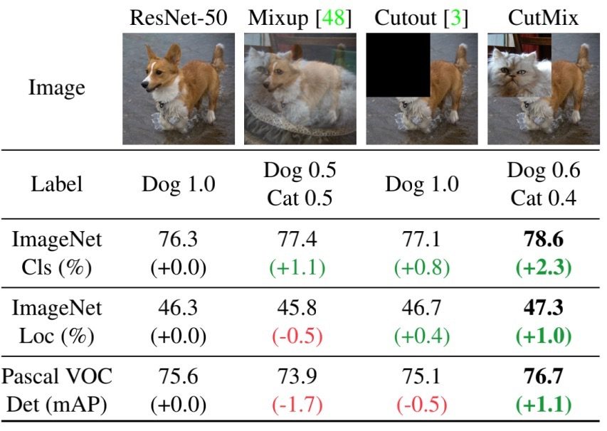
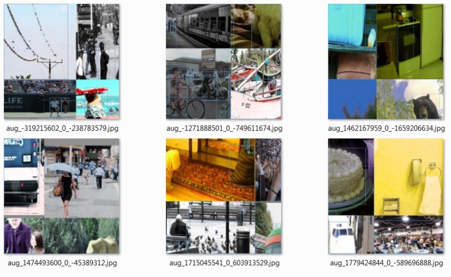
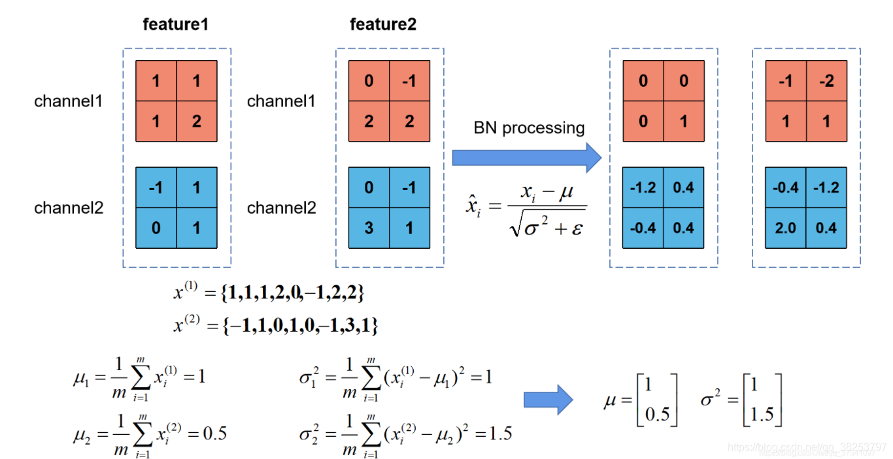
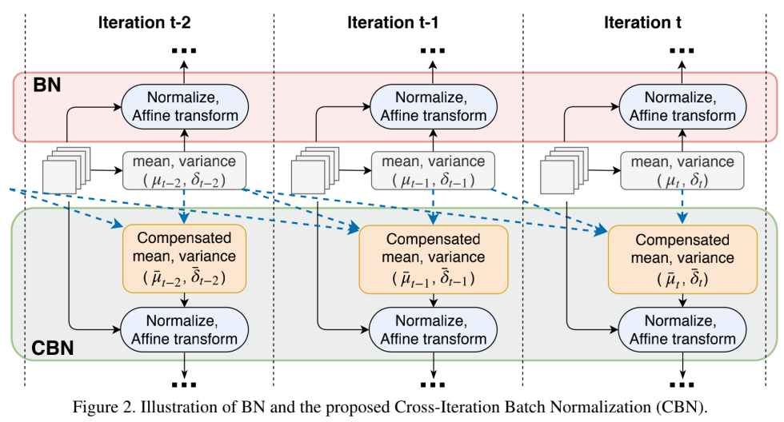

# 2. 简要介绍一下YOLOv4的特点
YOLOv4在v3基础上进行改进，还进行了一系列对比实验与trick的验证，并把他们放在YOLOv4里面。
+ 输入端的创新点：训练时对输入端的改进，主要包括Mosaic数据增强、cmBN、SAT自对抗训练
+ BackBone主干网络：各种方法技巧结合起来，包括：大量使用CSP结构、Mish激活函数、Dropblock。具体结构如下图

+ Neck：目标检测网络在BackBone和最后的输出层之间往往会插入一些层，比如YOLOv4中的SPP模块、FPN+PAN结构
+ Prediction：输出层的锚框机制和YOLOv3相同，主要改进的是训练时的回归框位置损失函数CIOU_Loss，以及预测框筛选的nms变为DIOU_nms

## 一问到底
### 2.1 Bag-of-Freebies与Bag-of-Specials的区别
在本文中作者将这些trick戏谑性地分成两种，并用商店促销名词“Bag-of-Freebies”（赠品包）与“Bag-of-Specials”（特价包)命名。（YOLO系列虽然影响巨大，但是论文的语言很口语化）
+ Bag-of-Freebies（赠品包，简称BoF）：指的是那些不增加模型复杂度，也不增加推理的计算量的训练方法技巧，来提高模型的准确度。具体包括  
    + 数据增强：图像几何变换（随机缩放，裁剪，旋转），Cutmix，Mosaic等
    + 网络正则化：Dropout,Dropblock等
    + 损失函数的设计：边界框回归的损失函数的改进 CIOU

+ Bag-of-Specials（特价包，简称BoS）：指的是那些增加少许模型复杂度或计算量的训练技巧，但可以显著提高模型的准确度。具体包括：
    + 增大模型感受野：SPP、ASPP等
    + 引入注意力机制：SE、SAM
    + 特征集成：PAN、BiFPN
    + 激活函数改进：Swish、Mish
    + 后处理方法改进：soft NMS、DIoU NMS

### 2.2 简要介绍一下Cutmix，Mosaic的等图片数据增强方式
[Cutmix数据增强](https://arxiv.org/abs/1905.04899v2)：从数据集中选出两张图，然后将一张图的某一部分进行裁剪叠加到另一张图上面作为新的输入图片放入网络中进行训练。如下图

Mosaic数据增强：CutMix的改进版，不再跨图片画框。同一框内不再有不同源图片。如下图


### 2.3 传统的BN计算过程是什么与作用有哪些？
传统的BN有如下的计算过程，BN是基于通道计算的，在所有过滤器中，每个通道算一份（均值，方差）。具体计算过程如图：

+ **训练时**，集中计算出的所有均值和方差，求平均，并设定为代表性均值方差
+ **推理时**，可以将BN层（一般称为frozen BN）等效替换为一个1x1卷积层。代入训练时计算出的新卷积层参数。

$$
\because f_{n+1} = W_{BN}(W_{conv}f_{n}  + b_{conv}) +b_{BN}
= W_{BN}W_{conv}f_{n}  + (W_{BN}b_{conv}+b_{BN})
$$

$$
\therefore \text{filter weights}=W_{BN}W_{conv} \\
$$

$$
\therefore \text{filter bias}=W_{BN}b_{conv}+b_{BN}
$$

+ **BN的affine**。由于归一化后的 ，基本会被限制在正态分布下，使得网络的表达能力下降。为解决该问题，我们引入两个新的参数： γ 和 β。 γ 和β是在训练时网络自己学习得到的。我们在pytorch中常用的是带affine（仿射）格式的BN，而不是常见的减均值除方差。
    + 没有加affine的公式 $y= \frac{x−E[x]}{\sqrt{Var[x]+ϵ}}$
    + 加入affine的公式 $y= \frac{x−E[x]}{\sqrt{Var[x]+ϵ}}∗γ+β$


使用BN后可以得以改善**内部协变量偏移**，因此BN的作用主要有以下几点:
```
【定义】内部协变量偏移
当前面的一些层（参数）发生很小的变化，会对后面的层造成很大的影响。后面的层需要不断的适应前面层的变化，导致非常难以训练。
```
+ 加快网络的训练和收敛的速度：在深度神经网络中中，如果每层的数据分布都不一样的话，将会导致网络非常难收敛和训练，而如果把每层的数据都在转换在均值为零，方差为1的标准正态状态下。每层数据分布（这里指每层中各自通道内的数据分布）都是一样，训练会比较容易收敛。

+ BN允许网络使用饱和性激活函数，缓解梯度消失：在不使用BN层的时候，由于网络的深度与复杂性，很容易使得底层网络变化累积到上层网络中，导致模型的训练很容易进入到激活函数的梯度饱和区，产生梯度消失；通过normalize操作可以让激活函数的输入数据落在梯度非饱和区，缓解梯度消失的问题。同理，因为限制在一定区间，也就在一定程度上避免了梯度爆炸的发生。
```
【定义】饱和函数
右饱和：当x趋向于正无穷时，函数的导数趋近于0，此时称为右饱和。
左饱和：当x趋向于负无穷时，函数的导数趋近于0，此时称为左饱和。
饱和函数和非饱和函数：当一个函数既满足右饱和，又满足左饱和，则称为饱和函数（如Sigmoid和tanh），否则称为非饱和函数。
```
+ 防止过拟合：在网络的训练中，BN的使用使得一个minibatch中所有样本都被关联在了一起，因此网络不会从某一个训练样本中生成确定的结果，即同样一个样本的输出不再仅仅取决于样本的本身，也取决于跟这个样本同属一个batch的其他样本，而每次网络都是随机取batch，这样就会使得整个网络不会朝这一个方向使劲学习。一定程度上避免了过拟合。


### 2.4 相较与BN的缺点，YOLOv4中使用的CmBN有什么点特征与作用？
BN有自己的缺点：当batch比较小时候，BN在batch维度统计不准确，导致准确率下降。常用的解决技巧就是设置mini batch，即网络前向mini batch次，然后再进行一次梯度更新，也是为了变相扩大batch size。这就是[CBN](https://arxiv.org/abs/2002.05712)（Cross-Iteration Batch Normalization）的思想：使用泰勒公式，对当前以及当前往前数n（n=3）个mini-batch的结果进行归一化。如下图：



CBN由于在每个mini batch内部都是标准的BN操作即:
+ 计算BN统计量
+ 应用BN
+ 更新可学习参数和网络权重

而CmBN的做法和前面两个都不一样，其把大batch内部的4个mini batch当做一个整体对外隔离，主要改变在于BN层的统计量计算方面，具体流程是：
+ 在第t时刻开始进行BN统计量汇合操作，仅仅在mini batch内部进行汇合操作
+ 对汇合后的mini batch内部进行BN运算
+ 在mini batch的最后一个时刻，进行参数更新和可学习参数更新

在yolov4中，CmBN是对CBN的改进简化版，为了减少内存消耗，提高训练速度。图片如下，~~(但官方图片很模糊，适当了解即可)~~


### 2.5 简单介绍一下yolov4中的SAT自对抗训练
CNN遗留问题：视觉上不可察觉的干扰的自然图像等对抗性样本会导致深层网络在图像分类上的失败。如下图，左侧为原始图像，有很好的检测效果，但是添加噪声后的右侧图像，会产生既然相反的检测结果。而造成这种差异的两张原始图像，我们用肉眼完全看不出来区别。

因此引入[SAT](https://export.arxiv.org/pdf/1703.08603)（Self-Adversarial Training，自对抗训练）。在训练过程中给原图加噪声，达到图片增强的目的。
它包括两个阶段
+ 第一阶段：神经网络更改原始图像。固定参数，用梯度更新图片，相当于给原图片加噪声（该阶段次数不用太多）。
+ 第二阶段：训练神经网络以正常方式在修改后的图像上执行目标检测任务，更新参数。

### 2.6 DenseNet的特点有哪些？相比于之前的网络，YOLOv4的CSPDarknet53有哪些特点与改进

#### 2.6.1 DenseNet的的特点
Dense Block稠密连接：一个Block中，每一层的输入来自它前面所有的特征图，每一层的输出均会直接连接到后面所有层的输入。如下图：


这样做优点很明显：
+ **参数变少**。更准确讲是参数复用，同等情况下
+ 特征更丰富。通道拼接，低级特征得以融合复用
+ 梯度容易传播。更强的梯度流动，跳层会了解更多

但是，随着层数增加，特征图会越叠越多。所以在Dense Block之间又使用了Transiton Layer进行降维操作。其本质上就是卷积+池化操作。(代码如下)。
``` python
#　实现连接两个DenseBlock的_Transition
#　输入参数有：num_input_feature    上一个DenseBlock的输出，(l-1)*k+k0个通道
#            num_output_features  下一个DenseBlock的输入。一般是0.5*num_input_feature
class _Transition(nn.Sequential):  #继承Sequential类
    """Transition layer between two adjacent DenseBlock"""
    def __init__(self, num_input_features, num_output_features):
        super(_Transition, self).__init__()
        self.add_module('norm', nn.BatchNorm2d(num_input_features))
        self.add_module('relu', nn.ReLU(inplace=True))
        #　两个方向的降维度：channel降为num_output_features设定值
        # 　              featuremap降为一半AvgPool2d
        self.add_module('conv', nn.Conv2d(num_input_features, num_output_features,
                                          kernel_size=1, stride=1, bias=False))
        self.add_module('pool', nn.AvgPool2d(kernel_size=2, stride=2, ceil_mode=True))

``` 
所以一个Dense Block块，往往考虑Dense Block与Transiton Layer两部分。


#### 2.6.2 YOLOv4中CSPDarknet53的特点与改进
```
该部分很论文公式写得很模糊，我重写公式并夹杂自己理解。
```
YOLOv4将YOLOv3大量残差层改进成CSP结构块, 具体结构如下：


CSP全名Cross Stage Partial DenseNet，是对DenseNet结构的改进。CSPNet的主要目的是使该体系结构能够实现 **更丰富的梯度组合，同时减少计算量** 。作者的主要想法是通过分割梯度流，使梯度流通过不同的网络路径传播。


上图为DenseNet单阶段结构的详细结构。DenseNet的每个阶段包含一个稠密块和一个过渡层，每个稠密块由k个稠密层组成。其中，第l层接收所有先前的层
$x_0,x_1,...,x_{k−1}$
的特征图作为输入。表示上述机理的方程可以表示为

$$
\begin{align*}
x_1 & = f(x_0, w_0) \\
x_2 & = f([x_1,x_0], w_1)  \\
 & ... \\
x_k & =f([x_{k-1},...,x_1,x_0], w_{k-1}) \\
x_T & = f([x_k,x_{k-1},...,x_1,x_0], w_{T}) \\
x_U & = f([x_T], w_{T}) \\
\end{align*}
$$

当做权值更新，对权值求导，可以得到如下

$$
\begin{align*}
\frac{\partial L}{\partial w_{T}} &= \frac{\partial f([x_k, x_{k-1},x_{k-2}, \underline{\textcolor{red}{x_{k-3}, ...,x_1,x_0}}], w_{T})}{\partial w_{T}} \\
\frac{\partial L_{k}}{\partial w_{k-1}} &= \frac{\partial f([x_{k-1},x_{k-2}, \underline{\textcolor{red}{x_{k-3}, ...,x_1,x_0}}], w_{k-1})}{\partial w_{k-1}} \\
\frac{\partial L_{k-1}}{\partial w_{k-2}} &= \frac{\partial f([x_{k-2}, \underline{\textcolor{red}{x_{k-3},...,x_1,x_0}}], w_{k-2})}{\partial w_{k-2}} \\
\frac{\partial L_{k-2}}{\partial w_{k-3}} & = \frac{\partial f([ \underline{\textcolor{red}{x_{k-3},...,x_1,x_0}}], w_{k-3})}{\partial w_{k-3}} \\
&...
\end{align*} 
$$

观察上面红色划线的部分可知，因为重复拼接，每个dense Layer层存在大量的重复的梯度信息，且越靠后重叠比率越大。更要命的一点在于，如果没有使用Transiton Layer降维，两个dense block可以叠起来之后，会将重复梯度问题一直延续下去。

在下图（b）里面，提出了CSPDenseNet块的改进概念。底层的特征图 $x_0$ 分成两部分 $[x_{0'}, x_{0''}]$ ，$x_{0''}$ 这部分经过dense block和transition 层，另一部分 $x_{0'}$ 再与transmitted feature map结合到下一阶段。


表示上述机理的方程可以表示为

$$
\begin{align*}
x_1 & = f(x_{0''}, w_0) \\
x_2 & = f([x_1,x_{0''}], w_1)  \\
 & ... \\
x_k & =f([x_{k-1},...,x_1,x_{0''}], w_{k-1}) \\
x_T & =f([x_k, x_{k-1},...,x_1,x_{0''}], w_{T}) \\
x_U & =f([x_{T},x_{0'}], w_{U}) \\
\end{align*}
$$

当做权值更新，对权值求导，可以得到如下

$$
\begin{align*}
\frac{\partial L_{U}}{\partial w_{U}} &= \frac{\partial f([\underline{\textcolor{green}{x_{U}, x_{0'}}}], w_{U})}{\partial w_{U}} \\
\frac{\partial L_T}{\partial w_{T}} &= \frac{\partial f([\underline{\textcolor{green}{x_k, x_{k-1},x_{k-2}, x_{k-3}, ...,x_1,x_{0''}}}], w_{T})}{\partial w_{T}} \\
\frac{\partial L_k}{\partial w_{k}} &= \frac{\partial f([x_{k-1},x_{k-2}, x_{k-3}, ...,x_1,x_{0''}], w_{k})}{\partial w_{k}} \\
&...
\end{align*} 
$$

上公式中绿色部分，因为不同的参数停止了重复梯度信息的蔓延趋势。而 $x_{0}''$ 分支又保留了DenseNet特性重用特性的优点，该思想通过设计一种分层的特征融合策略来实现，并应用于局部过渡层。

### 2.7 YOLOv4中为什么使用Mish激活函数？


