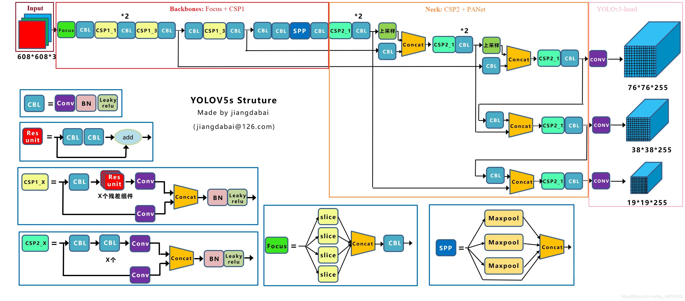
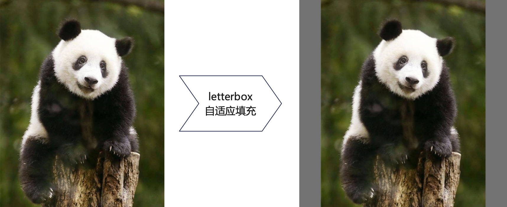
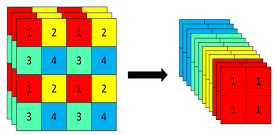
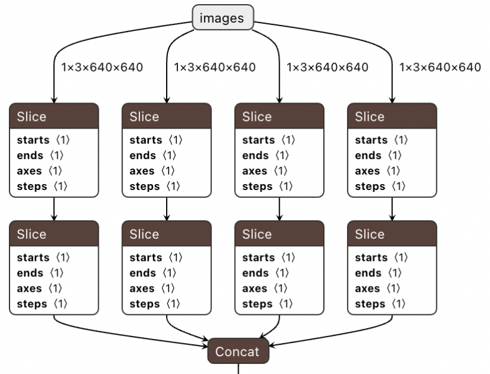
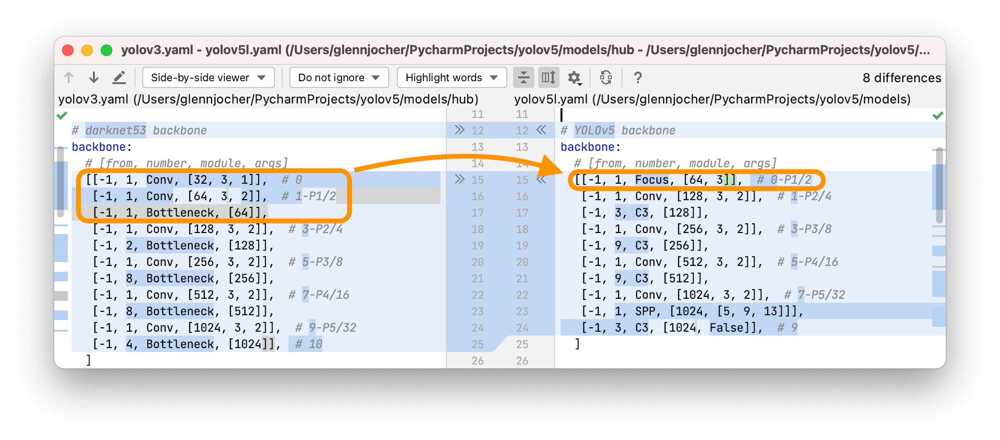
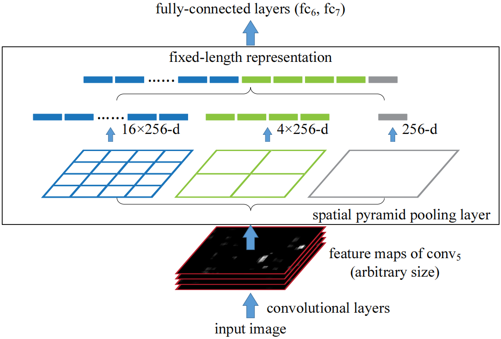

# 3. 简要介绍一下YOLOv5的特点
YOLOv5和v4都是在v3基础上改进的。因为YOLOv4是2020年4月开放出来的，YOLOv5是两个月后由另一个团队开源出来的，所以v4与v5在后续发展中相互借鉴，很多trick在互相使用。这里YOLOv4，v5没有继承关系。



## 3.1 自适应图片缩放
自适应缩放就是使用多余部分填充的方法，保持图片原始比例避免失真。如下图左侧是一张499x630的图片，如果输入为640x640的CNN网络时直接resize，那么图片比例会变形造成失真。



## 3.2 解释一下Focus的功能与作用，作者为什么将conv改成Focus层？
在YOLOv5的第六版代码以前，在网络层开始默认使用了一个Focus层。
在Focus模块中，每隔一个像素抽取一次，意图是使BGR3通道输入变12通道输入。这样我们就拿到了4张图片互补，长的差不多，没有信息丢失的通道。例如，原始640×640×3的图像输入Focus结构，采用切片操作，先变成320×320×12的特征图，再经过一次32个卷积核的卷积操作，最终变成320×320×32的特征图。





按照作者的说法，该操作大大减少计算量。注意Focus层不是对标一个Conv层，而是三个层。要是这么算的确是减少计算量了。例如官方提供的下图：



后面为了设备部署方便，将Focus层又改成了stride=2的下采样Conv，精度相差也不大。（个人感觉这是减少计算量）

## 3.2 在YOLOv4，v5中都在使用的SPP结构有什么特点？
SPP（spatial pyramid pooling，空间金字塔池化）结构来自于SPPNet，很简单：三尺度池化，一次直连堆叠。这种**多尺寸池化**主要目的是模拟不同输入尺寸，以便提升网络精度。结构图与代码如下



```python
class SpatialPyramidPooling(nn.Module):
    def __init__(self, pool_sizes=[5, 9, 13]):
        super(SpatialPyramidPooling, self).__init__()
        self.maxpools = nn.ModuleList([nn.MaxPool2d(pool_size, 1, pool_size//2) for pool_size in pool_sizes])

    def forward(self, x):
        features = [maxpool(x) for maxpool in self.maxpools[::-1]]
        features = torch.cat(features + [x], dim=1)
        return features
```
