# 1. 简要介绍YOLOv3的特点

YOLOv3采用独创的darknet系列网络作为主干网络。有如下工作：

+ darknet的设计借鉴了残差网络的思想，使用了大量的残差结构。darknet53与同等使用残差结构的resnet101、resnet152相比，在精度上基本相同，但在速度上更胜一筹。
+ 抛弃了pooling池化操作，直接使用步长为2的卷积来实现下采样。
+ 在特征融合方面，为了加强小目标的检测，引入了类似与FPN的多尺度特征融合，特征图在经过上采样后与前面层的输出进行concat操作，浅层特征和深层特征的融合，使得YOLOv3在小目标的精度上有了很大的提升。

YOLOv3的输出分为三个部分：置信度、坐标信息，分类信息。在推理的时候，特征图会等分成S\*S的网格，通过设置置信度阈值对格子进行筛选，如果某个格子上存在目标，那么这个格子就负责预测该物体的置信度、坐标和类别信息。

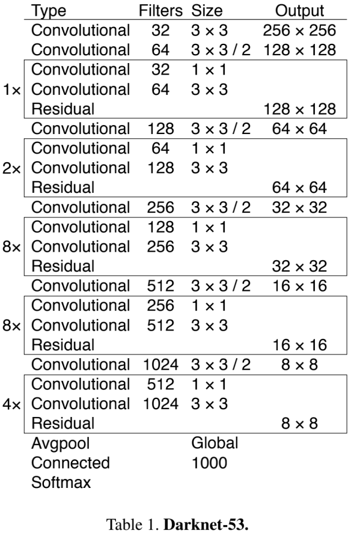

## 一问到底

### 1.1 残差结构的原理以及作用？

残差结构源自Resnet，ResNet网络是为了解决深度网络中的退化问题，即网络层数越深时，在数据集上表现的性能却越差。残差的本意是指实际观察值与估计值（拟合值）之间的差。下图为一个残差结构网络： $\text{Blockout:}H(x)=F(x)+x$ （反过来写就是残差形式 $F(x)=H(x)-x$ ，最终优化目标F(x)网络）


这么设计就是为了防止网络退化。极端情况学习到F(x)=0，此时H(x)=x。这样的神经网络不至于下一层结果比上一层结果还坏。本质上是个恒等（identity）代换

### 1.2* 数学证明Resnet有效

**证明一：梯度弥散（梯度为0）有效被针对（“网络可以更深”的原理证明）**
已知l+1层与l层的递归式，可得l层到L层的迭代式如下：

$$
x_{l+1}=x_l + F(x_l, W_l)
$$

$$
x_L=x_l+\sum_{i=l}^{L-1}F(x_i,W_i)
$$

~~（其实到这一步就已经可以看出来了）~~ 可得：

$$
\frac{∂\xi} {∂x_l} = \frac{∂\xi}{∂x_L}\frac{∂x_L}{∂x_l} = \frac{∂\xi}{∂x_L} (1 +\frac{∂}{∂x_l} \sum_{i=1}^{L-1}F(x_i, W_i))
$$

$\frac{∂\xi}{∂x_L}$ 部分不会为0。若为0，代表整体损失为0，应该考察下过拟合或网络错误问题。 $\frac{∂}{∂x_l} \sum\limits_{i=1}\limits^{L-1} F(x_i, W_i)$ 部分在一个batch中也不可能一直为-1。若一直为-1，那么说明网络完全更新不了。

**证明二：一维identity直连原理证明（“identity恒等分支不能随便加权重”原理证明）**
假设输入x前加上λ多线连接（λ是正整数，如果λ=0相当于不连接，λ=1相当于恒等identity连接，λ>1相当于在恒等连接上加个权重）那么递归式与迭代式的新格式如下：

$$
x_{l+1}=\lambda_l x_l + F(x_l, W_l)
$$

$$
x_L=(\prod_{i=1}^{L-1} \lambda_i)x_l+\sum_{i=l}^{L-1}(\prod_{j=i+1}^{L-1}\lambda_j)F(x_i,W_i)
$$

~~（同理细心地同学这一步也可以看出来了）~~ 从L层开始损失求导，其中利用中间变量求导原则

$$
\frac{∂\xi} {∂x_l} = \frac{∂\xi}{∂x_L}((\prod_{i=1}^{L-1} \lambda_i)+\frac{∂}{∂x_l}\sum_{i=l}^{L-1}(\prod_{j=i+1}^{L-1}\lambda_j) F(x_i,W_i) )
$$

λ=0时，相当于普通无残差结构，很容易梯度弥散;
λ>1时，仅 $\prod\limits_{i=1}\limits^{L-1} \lambda_i$ 这一项就容易造成梯度爆炸;
所以选择λ=1，identity恒等分支的模式。

### 1.3 上采样和下采样的区别与作用

下采样就是缩小特征图。它的作用就是降维抽取更抽象的信息。通用方法有各种池化操作(Pooling)、步长为2的普通卷积。
上采样就是放大特征图，一般是将较深层的信息附加给较浅层特征图上，所以上采样常常伴有特征的融合操作（特征图相加或简单连接）。它的作用是让较浅层的特征图能看见更多抽象信息。通用方法有反卷积(Deconvolution，也称转置卷积)、上池化(UnPooling)方法、双线性插值（各种插值算法）。

### 1.4* 反卷积为什么又叫转置卷积？
首先理解普通卷积可以认为是怎么算的。
我们可以将卷积操作写成一个矩阵。 其实这就是重新排列一下3\*3kernel矩阵, 使得我们通过一次矩阵乘法就能计算出卷积操作后的矩阵。

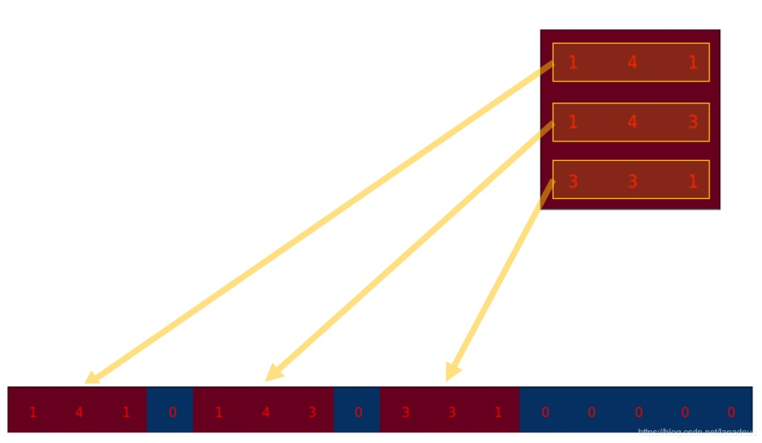

下图为3\*3kernel重排为4\*16的矩阵

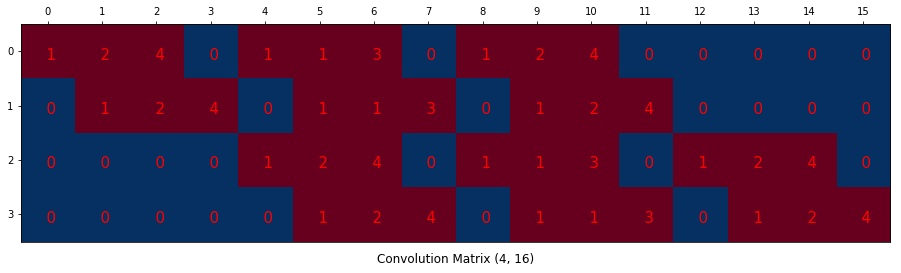

同时我们将尺寸为4\*4的input矩阵压扁(flatten)成一个尺寸为16\*1的列向量。此举为方便4\*16的卷积矩阵和16\*1的input矩阵(就是16维的列向量,只是看成一个矩阵)进行矩阵乘法.

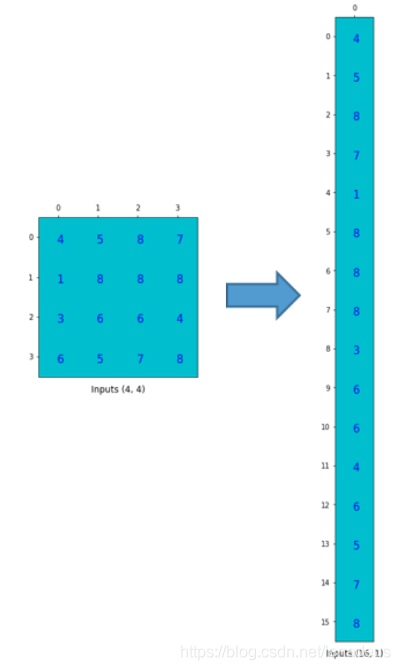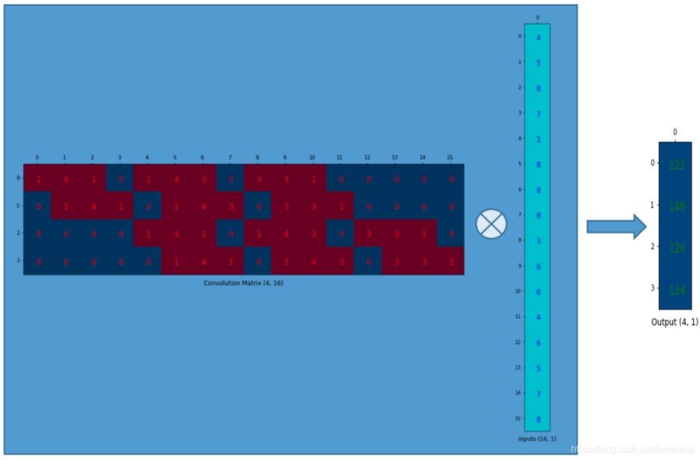

然后我们回到转置卷积的问题。转置卷积就是将卷积矩阵转置，如下：

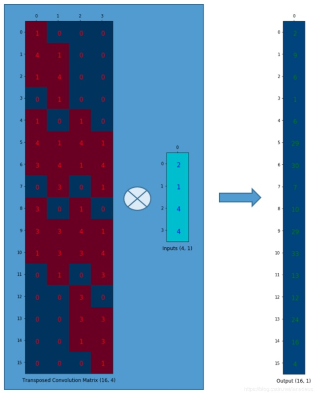

### 1.5 反卷积在神经网络中怎么计算？

反卷积的核心在于原特征地图填充。只要填充完毕，整体过程与普通卷积计算相似。

stride=1时，不需要填充，反卷积过程与卷积类似，如下图

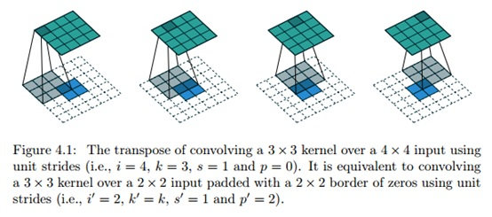

stride=2时，地图像素间填充1，反卷积过程与卷积类似，如下图

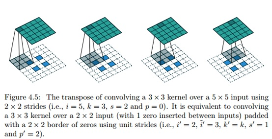

# 2. 简要介绍一下YOLOv4的特点
YOLOv4在v3基础上进行改进，还进行了一系列对比实验与trick的验证，并把他们放在YOLOv4里面。
+ 输入端的创新点：训练时对输入端的改进，主要包括Mosaic数据增强、cmBN、SAT自对抗训练
+ BackBone主干网络：各种方法技巧结合起来，包括：CSPDarknet53、Mish激活函数、Dropblock
+ Neck：目标检测网络在BackBone和最后的输出层之间往往会插入一些层，比如YOLOv4中的SPP模块、FPN+PAN结构
+ Prediction：输出层的锚框机制和YOLOv3相同，主要改进的是训练时的回归框位置损失函数CIOU_Loss，以及预测框筛选的nms变为DIOU_nms

## 一问到底
### 2.1 Bag-of-Freebies与Bag-of-Specials的区别
在本文中作者将这些trick戏谑性地分成两种，并用商店促销名词“Bag-of-Freebies”（赠品包）与“Bag-of-Specials”（特价包)命名。（YOLO系列虽然影响巨大，但是论文的语言很口语化）
+ Bag-of-Freebies（赠品包，简称BoF）：指的是那些不增加模型复杂度，也不增加推理的计算量的训练方法技巧，来提高模型的准确度。具体包括  
    + 数据增强：图像几何变换（随机缩放，裁剪，旋转），Cutmix，Mosaic等
    + 网络正则化：Dropout,Dropblock等
    + 损失函数的设计：边界框回归的损失函数的改进 CIOU

+ Bag-of-Specials（特价包，简称BoS）：指的是那些增加少许模型复杂度或计算量的训练技巧，但可以显著提高模型的准确度。具体包括：
    + 增大模型感受野：SPP、ASPP等
    + 引入注意力机制：SE、SAM
    + 特征集成：PAN、BiFPN
    + 激活函数改进：Swish、Mish
    + 后处理方法改进：soft NMS、DIoU NMS

### 2.2 简要介绍一下Cutmix，Mosaic的等图片数据增强方式
Cutmix数据增强：从数据集中选出两张图，然后将一张图的某一部分进行裁剪叠加到另一张图上面作为新的输入图片放入网络中进行训练。如下图
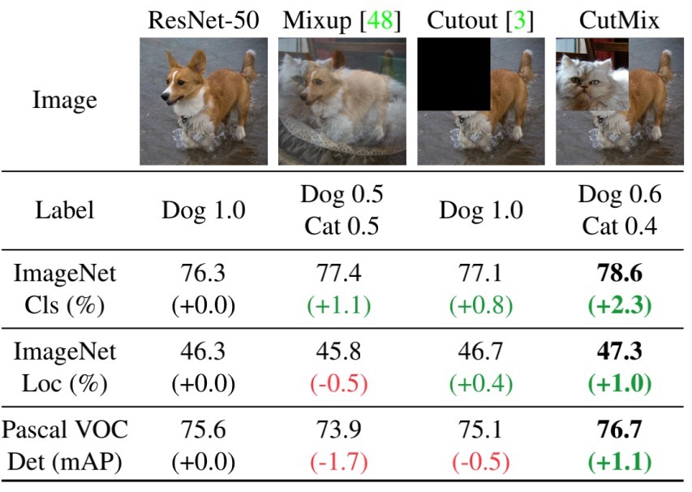
Mosaic数据增强：CutMix的改进版，不再跨图片画框。同一框内不再有不同源图片。如下图
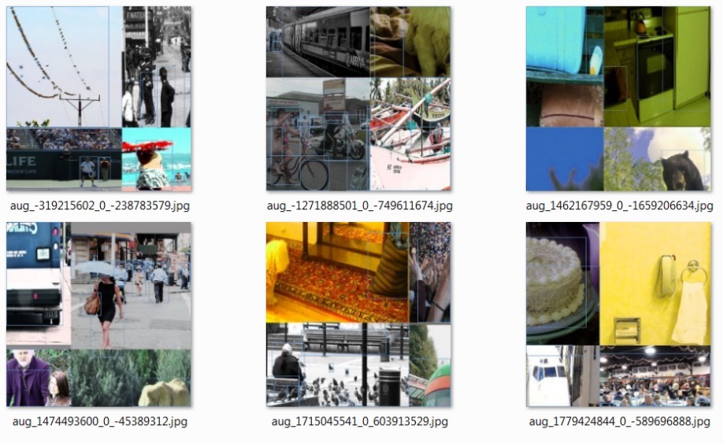

### 2.3 传统的BN计算过程是什么与作用有哪些？
传统的BN有如下的计算过程，BN是基于通道计算的，在所有过滤器中，每个通道算一份（均值，方差）。具体计算过程如图：
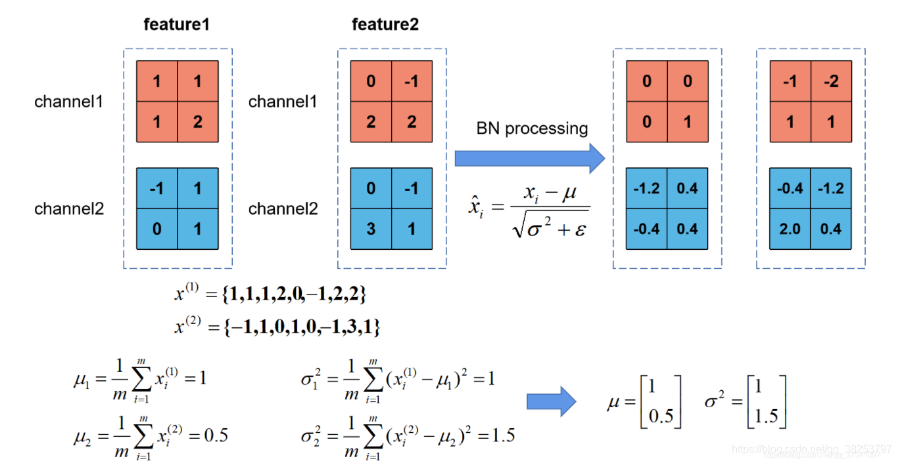
+ **训练时**，集中计算出的所有均值和方差，求平均，并设定为代表性均值方差
+ **推理时**，可以将BN层（一般称为frozen BN）等效替换为一个1x1卷积层。代入训练时计算出的新卷积层参数。

$$
\because f_{n+1} = W_{BN}(W_{conv}f_{n}  + b_{conv}) +b_{BN}
= W_{BN}W_{conv}f_{n}  + (W_{BN}b_{conv}+b_{BN})
$$

$$
\therefore \text{filter weights}=W_{BN}W_{conv} \\
$$

$$
\therefore \text{filter bias}=W_{BN}b_{conv}+b_{BN}
$$

+ **BN的affine**。由于归一化后的 ，基本会被限制在正态分布下，使得网络的表达能力下降。为解决该问题，我们引入两个新的参数： γ 和 β。 γ 和β是在训练时网络自己学习得到的。我们在pytorch中常用的是带affine（仿射）格式的BN，而不是常见的减均值除方差。
    + 没有加affine的公式 $y= \frac{x−E[x]}{\sqrt{Var[x]+ϵ}}$
    + 加入affine的公式 $y= \frac{x−E[x]}{\sqrt{Var[x]+ϵ}}∗γ+β$


使用BN后可以得以改善**内部协变量偏移**，因此BN的作用主要有以下几点:
```
【定义】内部协变量偏移
当前面的一些层（参数）发生很小的变化，会对后面的层造成很大的影响。后面的层需要不断的适应前面层的变化，导致非常难以训练。
```
+ 加快网络的训练和收敛的速度：在深度神经网络中中，如果每层的数据分布都不一样的话，将会导致网络非常难收敛和训练，而如果把每层的数据都在转换在均值为零，方差为1的标准正态状态下。每层数据分布（这里指每层中各自通道内的数据分布）都是一样，训练会比较容易收敛。

+ BN允许网络使用饱和性激活函数，缓解梯度消失：在不使用BN层的时候，由于网络的深度与复杂性，很容易使得底层网络变化累积到上层网络中，导致模型的训练很容易进入到激活函数的梯度饱和区，产生梯度消失；通过normalize操作可以让激活函数的输入数据落在梯度非饱和区，缓解梯度消失的问题。同理，因为限制在一定区间，也就在一定程度上避免了梯度爆炸的发生。
```
【定义】饱和函数
右饱和：当x趋向于正无穷时，函数的导数趋近于0，此时称为右饱和。
左饱和：当x趋向于负无穷时，函数的导数趋近于0，此时称为左饱和。
饱和函数和非饱和函数：当一个函数既满足右饱和，又满足左饱和，则称为饱和函数（如Sigmoid和tanh），否则称为非饱和函数。
```
+ 防止过拟合：在网络的训练中，BN的使用使得一个minibatch中所有样本都被关联在了一起，因此网络不会从某一个训练样本中生成确定的结果，即同样一个样本的输出不再仅仅取决于样本的本身，也取决于跟这个样本同属一个batch的其他样本，而每次网络都是随机取batch，这样就会使得整个网络不会朝这一个方向使劲学习。一定程度上避免了过拟合。


### 2.4 相较与BN的缺点，YOLOv4中使用的CmBN有什么点特征与作用？
BN有自己的缺点：当batch比较小时候，BN在batch维度统计不准确，导致准确率下降。常用的解决技巧就是设置mini batch，即网络前向mini batch次，然后再进行一次梯度更新，也是为了变相扩大batch size。这就是CBN（[Cross-Iteration Batch Normalization](https://arxiv.org/abs/2002.05712)）的思想：使用泰勒公式，对当前以及当前往前数n（n=3）个mini-batch的结果进行归一化。如下图：

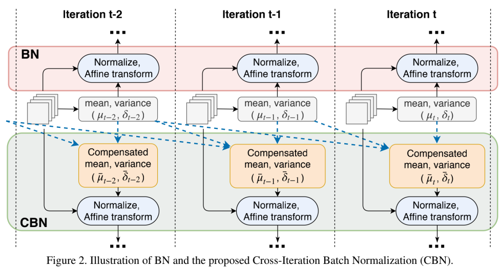

CBN由于在每个mini batch内部都是标准的BN操作即:
+ 计算BN统计量
+ 应用BN
+ 更新可学习参数和网络权重

而CmBN的做法和前面两个都不一样，其把大batch内部的4个mini batch当做一个整体对外隔离，主要改变在于BN层的统计量计算方面，具体流程是：
+ 在第t时刻开始进行BN统计量汇合操作，仅仅在mini batch内部进行汇合操作
+ 对汇合后的mini batch内部进行BN运算
+ 在mini batch的最后一个时刻，进行参数更新和可学习参数更新

在yolov4中，CmBN是对CBN的改进简化版，为了减少内存消耗，提高训练速度。图片如下，~~(但官方图片很模糊，适当了解即可)~~
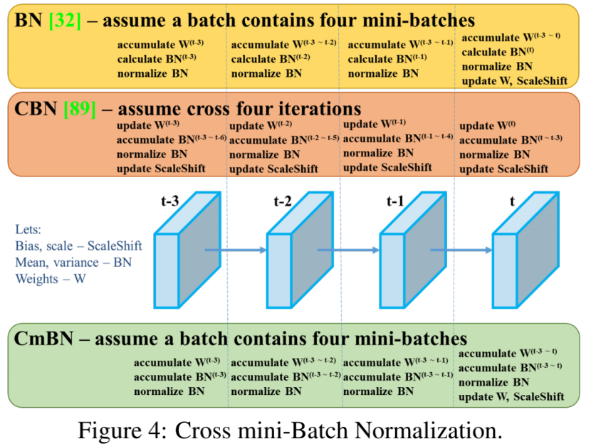

### 2.5 简单介绍一下yolov4中的SAT自对抗训练
SAT（Self-Adversarial Training，自对抗训练）。在训练过程中给原图加噪声，达到图片增强的目的
它包括两个阶段
+ 第一阶段：神经网络更改原始图像。固定参数，用梯度更新图片，相当于给原图片加噪声（该阶段次数少即可）。
+ 第二阶段：训练神经网络以正常方式在修改后的图像上执行目标检测任务，更新参数。
